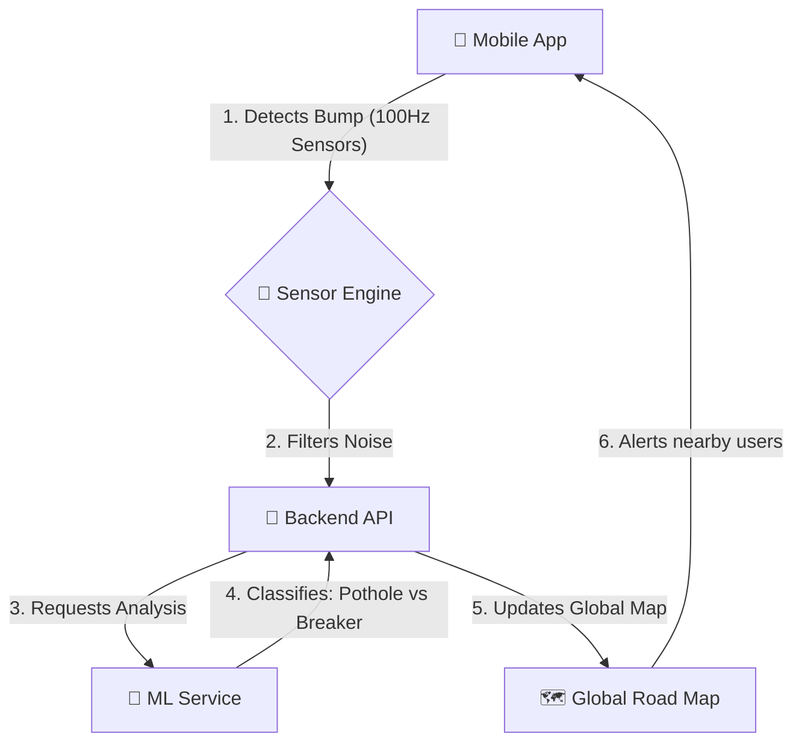

# 🛣️ RoadSense AI (Kotlin Edition)

**RoadSense AI** is a smart road-monitoring platform. It uses your phone's built-in sensors (like the accelerometer) and Machine Learning to detect potholes, speed breakers, and other road anomalies in real-time as you drive.

> [!NOTE]
> This project has been fully migrated from a JavaScript/Python stack to a unified **Kotlin** ecosystem for better performance and type safety.

---

## 🏗️ How it Works (The Workflow)

RoadSense operates in a three-step cycle: **Sense**, **Process**, and **View**.



### 1. The Mobile App (The "Sensor")
Your phone acts as a sophisticated data collector. It samples the accelerometer **100 times per second**.
- **Auto-Orientation**: It doesn't matter how you place your phone; the app mathematically "straightens" the data.
- **Dynamic Thresholds**: The app adjusts its sensitivity based on your speed (e.g., higher speed = higher sensitivity).

### 2. The Backend (The "Brain")
Built with **Ktor**, it handles:
- User accounts and security (JWT).
- Storing "Points of Concern" (PoCs) sent by the app.
- Coordinating with the ML service to confirm if a bump is actually a pothole.

### 3. The ML Service (The "Expert")
A specialized Kotlin service that uses a **Decision Tree** algorithm to look at the "signature" of a bump and decide what it is.

---

## 🛠️ Tech Stack for Beginners

| Component | Technology | Why we use it? |
| :--- | :--- | :--- |
| **Mobile UI** | Jetpack Compose | Modern, easy way to build Android screens with code. |
| **Backend** | Ktor | A lightweight and fast Kotlin framework for APIs. |
| **Database** | Exposed (ORM) | A way to talk to the database using Kotlin instead of raw SQL. |
| **Networking** | Retrofit / Ktor Client | How the app and server talk to each other over the internet. |

---

## 🚀 Getting Started

### 1. Prerequisites
- **Android Studio** (LATEST version).
- **IntelliJ IDEA** (Optional, for backend).
- **PostgreSQL** (The database where we store road data).

### 2. Setting up the Backend
1. Open the `backend-kotlin` folder.
2. Create a `.env` file (or set environment variables):
   ```bash
   DATABASE_URL=jdbc:postgresql://localhost:5432/roadsense
   DB_USER=your_user
   DB_PASSWORD=your_password
   ```
3. Run it: `./gradlew run`.

### 3. Setting up the ML Service
1. Open the `ml-kotlin` folder.
2. Run it: `./gradlew run`. It will start on port `8001`.

### 4. Running the App
1. Open **Android Studio**.
2. Go to `File > Open` and select the **`mobile-kotlin`** folder.
3. Wait for the "Gradle Sync" to finish.
4. Select an **Emulator** (Pixel 7/8 recommended) or a physical device.
5. Click the green **Run** button.

---

## 🧪 How to Test "Bumps" in the Emulator
If you don't have a car and a bumpy road right now, you can simulate it:
1. Open the **Emulator**.
2. Click the **three dots (...)** at the bottom of the sidebar.
3. Go to **Virtual Sensors > Device Rotation**.
4. Wiggle the phone model quickly. In the app, you will see the **Z Force** spike!

---

## 📂 Project Structure
- `/mobile-kotlin`: The Android App. Look in `MainActivity.kt` for the UI.
- `/backend-kotlin`: The Server. Look in `routes/` for the API logic.
- `/ml-kotlin`: The Intelligence. Look in `ml/Classifier.kt` for the decision logic.

---

## 🤝 Contributing
Welcome! If you're a beginner, feel free to open an Issue if you get stuck. We love helping new developers.
